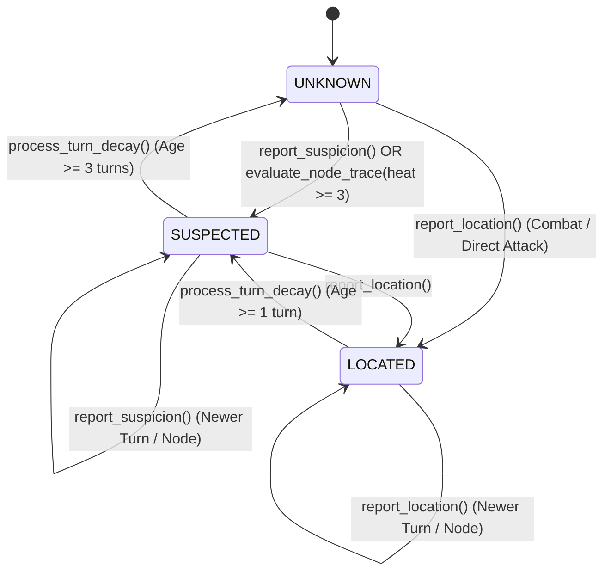

# Phase C4 Architecture Design & Safety Specification: Strategic Heat, Detection & Threat

> **Status:** `PROPOSED DESIGN AUDIT & CONTRACT (Phase C4-A.1)`  
> **Target Version:** `Godot 4.6.2.stable`  
> **Baseline Commit:** `fe55a298ae29bcdbbb435b9012a2572bfdb3f2cd`

---

## 1. Architectural Scope & Invariant Firewalls

`[VERIFIED CURRENT BEHAVIOR]`  
- Tactical combat, physical 35x35 cell movement (`BoardManager`), and tactical heat (`HeatWantedSystem.heat`) are completely separate subsystems.  
- Strategic navigation operates strictly on the topological graph in `CampaignNodeRegistry` (`nodes` and `routes`), tracked by `GlobalData.current_campaign_player_node_id`.  
- `CampaignTurnExecutive` is the sole authoritative entry point for advancing world turns.

`[PROPOSED CONTRACT]`  
Phase C4 establishes the strategic intelligence and pressure layer of the Valkren campaign map across three distinct authorities:
1. **Strategic Heat (`CampaignStrategicHeat`):** Operational noise and physical trace left behind at strategic nodes.
2. **Strategic Detection (`CampaignStrategicDetection`):** Faction-specific intelligence and suspicion regarding the player's presence.
3. **Strategic Threat (`CampaignStrategicThreat`):** Derived read-only evaluation of hostile force pressure, route interdiction, and danger.

> [!IMPORTANT]
> **Strict Firewall Invariant `[PROPOSED CONTRACT]`:**  
> Strategic Heat, Detection, and Threat MUST NEVER mutate or alias tactical `HeatWantedSystem.heat` or `GlobalData.board.board_patrols`.

---

## 2. Action-Dispatch & Exposure Coverage Matrix

`[VERIFIED CURRENT BEHAVIOR]`  
`CampaignPlayerDispatch` is a pure routing boundary. It validates intent (`action_id`, `node_id`, `is_player_at_node`) and dispatches to registered domain handlers. Strategic movement does NOT go through `CampaignPlayerDispatch`, but through `CampaignPlayerMovement.move_player_to_node()`.

`[PROPOSED CONTRACT]`  
Action exposure is recorded **only upon confirmed, successful action execution** via an exposure hook. Failed, rejected, or cancelled actions generate zero heat.

| Action / Operation | Entry Point `[VERIFIED]` | Turn Advancement `[VERIFIED]` | Exposure Hook Location `[PROPOSED CONTRACT]` | Base Strategic Heat `[PROVISIONAL BALANCE VALUE]` | Detection Exposure `[PROPOSED CONTRACT]` |
|---|---|:---:|---|:---:|---|
| **Attack** | `CampaignPlayerDispatch` $\to$ `CampaignAttackAction.handle_attack()` | No (Turn separate) | `CampaignPlayerDispatch` post-success | `+3` at target node | Sets defending faction detection to `LOCATED` at node |
| **Capture** | `CampaignPlayerDispatch` $\to$ `CampaignCaptureAction.handle_capture()` | No (Turn separate) | `CampaignPlayerDispatch` post-success | `+2` at target node | Sets territory controller detection to `SUSPECTED` |
| **Resupply** | `CampaignPlayerDispatch` $\to$ `CampaignResupplyAction.handle_resupply()` | No (Turn separate) | `CampaignPlayerDispatch` post-success | `+1` (in non-allied territory) | Elevates territory suspicion if trace threshold met |
| **Trade** | `CampaignPlayerDispatch` $\to$ `CampaignTradeAction.handle_trade()` | No (Turn separate) | `CampaignPlayerDispatch` post-success | `+1` (in non-allied territory) | Elevates territory suspicion if trace threshold met |
| **Investigate** | `CampaignPlayerDispatch` $\to$ `CampaignInvestigateAction.handle_investigate()` | No (Turn separate) | `CampaignPlayerDispatch` post-success | `0` (Covert recon) | Zero detection change |
| **Strategic Movement** | `CampaignPlayerMovement.move_player_to_node()` | No (Turn separate) | `CampaignPlayerMovement` post-success | `+1` (if entering hostile territory) | Zero direct locate; leaves residual movement trace |
| **Combat Resolution** | `GameManager._on_combat_ended()` $\to$ `CampaignBattle` | Separate hook | `CampaignBattle` resolution | `+0` (Handled by prior attack intent) | Refreshes last known combat node |

---

## 3. The Meaning & Lifecycle of Strategic Heat

`[VERIFIED IMPLEMENTED BEHAVIOR (Phase C4-B1)]`  
Strategic Heat represents **node-local residual operational traces** (e.g. communications activity, combat debris, supply signatures, scouting sightings).

- **Implementation:** `scripts/systems/campaign_strategic_heat.gd` (`CampaignStrategicHeat`).
- **Granularity:** Node-local integer stored in `CampaignStrategicHeat` (`0..10`).
- **Storage:** `_node_heats: Dictionary[String, int]` mapping `node_id -> heat_level`.
- **Clamping:** `0 <= heat_level <= 10` (`MIN_HEAT = 0`, `MAX_HEAT = 10`).
- **Decay Semantics:**
  - Decays by positive amounts down to `MIN_HEAT` (`0`).
  - Implements `decay_node_heat(node_id, amount)` and `decay_all_nodes(amount)`.
- **Isolation:** Completely isolated from tactical `HeatWantedSystem.heat` and `GlobalData.board.board_patrols`.
- **Verification:** Verified by `test/unit/campaign_strategic_heat_verify.tscn` (48/48 checks passed, exit code 0).

---

## 4. Deterministic Strategic Detection State Machine

`[VERIFIED IMPLEMENTED BEHAVIOR (Phase C4-B2)]`  
Strategic Detection represents **authoritative, faction-specific intelligence** possessed by each faction regarding the player's presence.

- **Implementation:** `scripts/systems/campaign_strategic_detection.gd` (`CampaignStrategicDetection`).
- **Granularity:** Faction-keyed dictionary mapping `faction_id -> IntelligenceRecord Dictionary`.
- **States (`DetectionState` enum):**
  - `UNKNOWN (0)`: Faction has zero usable current intelligence about the player's location.
  - `SUSPECTED (1)`: Faction detects operational traces (`node_heat >= 3`) or has decaying stale location records. Confirms player activity in the region, but exact node is unconfirmed.
  - `LOCATED (2)`: Faction has confirmed player presence at a specific node (via combat, direct attack action, or credible reconnaissance).

### Freshness & Turn Degradation Policy
- `LOCATED` intelligence remains fresh for `LOCATED_MAX_AGE_TURNS = 1` turn. When turn age $\ge 1$, `process_turn_decay(current_turn)` gracefully degrades the record to `SUSPECTED` at `last_known_node_id`.
- `SUSPECTED` intelligence remains active for `SUSPECTED_MAX_AGE_TURNS = 3` turns. When turn age $\ge 3$, `process_turn_decay(current_turn)` expires the record back to `UNKNOWN` (`last_known_node_id = ""`).
- **Stale Event Protection:** Events with a turn timestamp strictly older than the faction's existing `last_known_turn` are safely rejected as `stale_event`.

### Deterministic State Transition Matrix

| Current State | Inbound Event / Trigger | Condition | Resulting State | `last_known_node_id` | Source Recorded |
|---|---|---|---|---|---|
| `UNKNOWN` | `report_suspicion` | Valid node | `SUSPECTED` | Target Node | `"suspicion_report"` / custom |
| `UNKNOWN` | `report_location` | Valid node | `LOCATED` | Target Node | `"combat"` / `"direct_attack"` / custom |
| `UNKNOWN` | `evaluate_node_trace` | Heat $\ge 3$ | `SUSPECTED` | Trace Node | `"node_trace"` |
| `UNKNOWN` | `evaluate_node_trace` | Heat $< 3$ | `UNKNOWN` | `""` | None |
| `SUSPECTED` | `report_suspicion` | Same or New Node | `SUSPECTED` | Updated Node | Updated source |
| `SUSPECTED` | `report_location` | Valid node | `LOCATED` | Target Node | Elevated source |
| `SUSPECTED` | `process_turn_decay` | Age $\ge 3$ turns | `UNKNOWN` | `""` | `"expired_suspicion"` |
| `LOCATED` | `report_location` | Newer turn/node | `LOCATED` | New Node | Updated source |
| `LOCATED` | `process_turn_decay` | Age $\ge 1$ turn | `SUSPECTED` | Preserved | `"stale_location"` |
| Any | `CampaignStrategicHeat.decay` | Heat cools to 0 | **No Change** | Preserved | Historical intel preserved |
| Any | Older Turn Event | `event_turn < last_known_turn` | **Rejected** | Unchanged | Stale event rejected |

### Anti-Omniscience Invariants `[VERIFIED]`
1. **Multi-Faction Isolation:** Faction intelligence dictionaries are strictly isolated. Reporting location for `federation` does not alter `zeon` or `outland` intelligence.
2. **Zero Global Leakage:** `GlobalData.current_campaign_player_node_id` is never read to derive or update faction detection. Intelligence requires explicit events or trace evaluation.
3. **Heat vs Intelligence Separation:** Physical heat traces in `CampaignStrategicHeat` can only elevate a faction to `SUSPECTED` (at `heat >= 3`), never `LOCATED`. Complete decay of physical heat to 0 does not erase historical intelligence.
4. **Lifecycle Reset:** `CampaignStrategicDetection.reset()` is wired into `GlobalData.reset_run_data()`.
5. **Verification:** Verified by `test/unit/campaign_strategic_detection_verify.tscn` (86/86 checks passed, exit code 0).

---

## 5. The Operational Meaning of Threat

`[PROPOSED CONTRACT]`  
`CampaignStrategicThreat` is a **pure derived read model (stateless calculation)**. It does NOT store authoritative mutable state or attack orders.

### What Threat Level Communicates to Player (`0..3`):
- `0 (SECURE)`: Allied or neutral node with zero hostile forces within 1 hop.
- `1 (ELEVATED)`: Hostile force within 1 route-hop, or adjacent hostile territory.
- `2 (INTERDICTED)`: Hostile force co-located at node, or hostile base present.
- `3 (CRITICAL)`: Hostile force co-located with `LOCATED` player detection status.

### Authority Split:
- **Threat Query:** `CampaignStrategicThreat.get_threat_level(node_id)` computes dynamically from `CampaignForce`, `CampaignBase`, `FactionSystem`, and `CampaignStrategicDetection`.
- **Enemy Intent & Execution:** Belongs to future strategic AI decision systems (e.g. `CampaignForceMovement`), which query `CampaignStrategicThreat` and `CampaignStrategicDetection` to select route movement.

---

## 6. Campaign Turn Ordering & Integration

`[VERIFIED CURRENT BEHAVIOR]`  
Current `CampaignTurnExecutive.PHASE_ORDER`:
1. `PHASE_BEGIN`
2. `PHASE_FACTION_ECONOMY`
3. `PHASE_SPY`
4. `PHASE_ENEMY_BASE`
5. `PHASE_COMPATIBILITY` (`EventBus.board_day_ended.emit()`)
6. `PHASE_RIVAL`
7. `PHASE_ERA`
8. `PHASE_SCAVENGER`
9. `PHASE_END`

`[PROPOSED CONTRACT]`  
Integration sequence in `CampaignTurnExecutive`:

| Phase Order | Phase Name | Subsystem Owner | Exact Action & Side Effects |
|:---:|---|---|---|
| 1 | `PHASE_BEGIN` | `CampaignTurnExecutive` | Turn receipt initialization |
| 2 | `PHASE_FACTION_ECONOMY` | `FactionEconomySystem` | World market & resources |
| 3 | `PHASE_SPY` | `EnemyFactionSystem` | Enemy intelligence rolls |
| 4 | `PHASE_ENEMY_BASE` | `EnemyFactionSystem` | Research node construction ticks |
| **5** | **`PHASE_STRATEGIC_DETECTION`** | `CampaignStrategicDetection` | **Evaluate traces, update `SUSPECTED`, degrade departed `LOCATED`** |
| **6** | **`PHASE_STRATEGIC_THREAT`** | `CampaignStrategicThreat` | **Evaluate hostile force posture and route interdiction** |
| **7** | **`PHASE_STRATEGIC_HEAT`** | `CampaignStrategicHeat` | **Apply dissipation (decay all node heat by 1 down to 0)** |
| 8 | `PHASE_COMPATIBILITY` | `EventBus` | `board_day_ended` compatibility fan-out |
| 9 | `PHASE_RIVAL` | `RivalProgressionSystem` | Rival pilot simulation |
| 10 | `PHASE_ERA` | `WarEraSystem` | War era simulation |
| 11 | `PHASE_SCAVENGER` | `ScavengerSystem` | Neutral salvage events |
| 12 | `PHASE_END` | `CampaignTurnExecutive` | Receipt finalization & signal emission |

*Rationale:* Detection and Threat evaluate active player traces **before** Heat decays, preventing fresh traces from dissipating before enemy systems can react.

---

## 7. Persistence & Backward-Compatibility

`[VERIFIED CURRENT BEHAVIOR]`  
`SaveGameIO` validates root dictionaries via `_DICT_FIELDS`.

`[PROPOSED CONTRACT]`  
1. Add `"campaign_strategic_heat"` and `"campaign_strategic_detection"` to `_DICT_FIELDS` in `SaveGameIO`.
2. Missing keys in legacy saves default to `{}` with zero errors.
3. In deserialization, clamp node heat `0..10` and sanitize detection states against canonical enum values.
4. `CampaignStrategicThreat` requires zero serialization because it is purely derived.

---

## 8. Phased Implementation Plan (C4-B1 $\to$ C4-B6)

1. **C4-B1: Authoritative Strategic Heat (`CampaignStrategicHeat`) — `[COMPLETED & VERIFIED]`**
   - Files: `scripts/systems/campaign_strategic_heat.gd`, test in `test/unit/campaign_strategic_heat_verify.tscn`.
   - Scope: Node heat storage, clamping (`0..10`), manual add/decay methods, reset, serialization helpers.
   - Status: **PASSED (48/48 assertions, exit code 0)**.
2. **C4-B2: Strategic Detection State Machine (`CampaignStrategicDetection`) — `[COMPLETED & VERIFIED]`**
   - Files: `scripts/systems/campaign_strategic_detection.gd`, test in `test/unit/campaign_strategic_detection_verify.tscn`.
   - Scope: Faction detection dictionary, state enum, deterministic transition logic, anti-omniscience rules, turn degradation, lifecycle reset in `GlobalData.reset_run_data()`.
   - Status: **PASSED (86/86 assertions, exit code 0)**.
3. **C4-B3: Derived Strategic Threat Query (`CampaignStrategicThreat`) — `[NEXT STEP]`**
   - Files: `scripts/systems/campaign_strategic_threat.gd`, test in `test/unit/`.
   - Scope: Pure function calculating threat level `0..3` from node forces, bases, and detection.
4. **C4-B4: Turn Executive Integration**
   - Files: `scripts/systems/campaign_turn_executive.gd`.
   - Scope: Wire `PHASE_STRATEGIC_DETECTION`, `PHASE_STRATEGIC_THREAT`, `PHASE_STRATEGIC_HEAT`.
5. **C4-B5: Persistence & Backward Compatibility**
   - Files: `scripts/systems/save_game_io.gd`, test in `test/unit/`.
   - Scope: Add `_DICT_FIELDS`, serialize/deserialize with legacy fallback.
6. **C4-B6: Action Dispatch & Movement Integration**
   - Files: `scripts/systems/campaign_player_dispatch.gd`, `scripts/systems/campaign_player_movement.gd`.
   - Scope: Trigger heat and detection hooks upon confirmed action/travel success.
